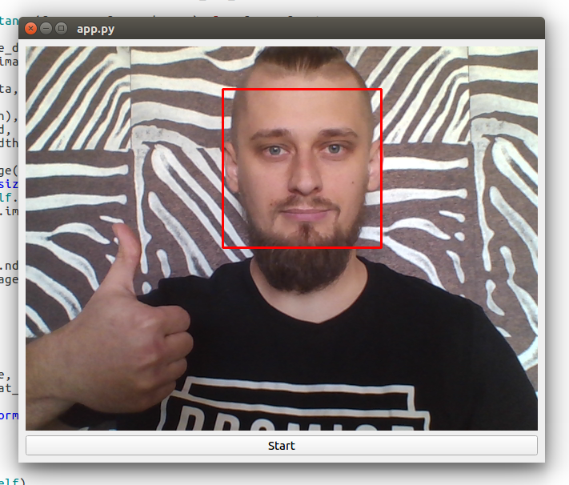

# Simple demo of using PyQt, OpenCV and Haar Cascades for face detection in real-time

### Report example


## How to run script
```
pip3 install -r ../requirements.txt
```

Run script:
```
python3 app.py
```

## Subscribe to our Machine Learning blog
[Blog](https://medium.com/machine-learning-world)
[Telegram channel](https://t.me/ml_world)

## Support 

If you like what im doing, you can send me some money for pepsi(i dont drink alcohol).
https://www.paypal.me/creotiv

