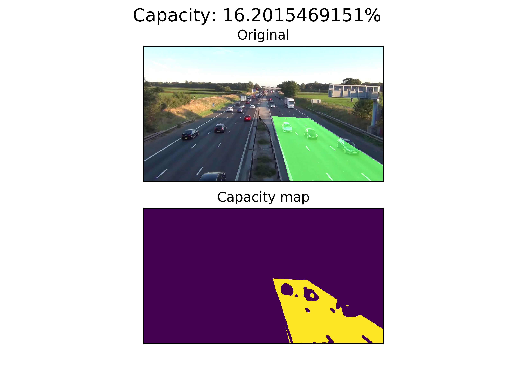
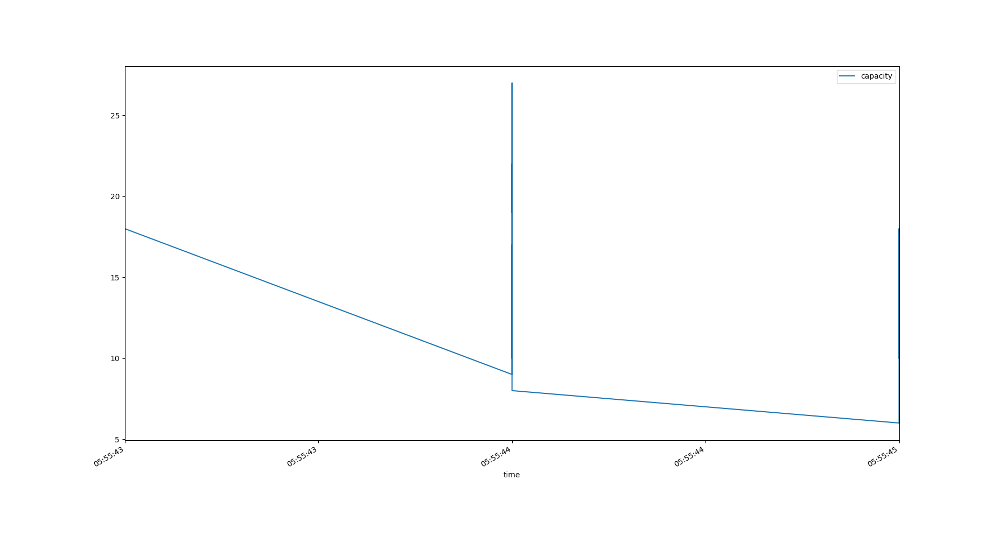

# Road Traffic capacity counting example based on OpenCV

You can read article for this code [here](https://hackernoon.com/tutorial-counting-road-traffic-capacity-with-opencv-998580f1fbde)

### Visualization demo


### Report example


## Data
Go to http://keepvid.com/ and download video in 720p quality with url https://youtu.be/wqctLW0Hb_0

After running the script with defualt settings you will get **./out** dir with debug frames images and **report.csv** file with format "time, vehicles".

## How to run script
```
pip install -r ../requirements.txt
```

Edit **traffic_capacity.py** if needed:
```
IMAGE_DIR = "./out"
VIDEO_SOURCE = "input.mp4"
SHAPE = (720, 1280)  # HxW
AREA_PTS = np.array([[780, 716], [686, 373], [883, 383], [1280, 636], [1280, 720]]) 

...

pipeline = PipelineRunner(pipeline=[
    CapacityCounter(area_mask=area_mask, image_dir=IMAGE_DIR),
    ContextCsvWriter('./report.csv',start_time=1505494325, fps=1, faster=10, field_names=['capacity']) # saving every 10 seconds
], log_level=logging.DEBUG)
```
Run script:
```
python traffic.py
```

## How to create video from processed images
```
chmod a+x make_video.sh
./make_video.sh
```

## How to create report plot
```
python plot.py [path to the csv report] [number of seconds to group by] 
```
## Subscribe to our Machine Learning blog
[Blog](https://medium.com/machine-learning-world)
[Telegram channel](https://t.me/ml_world)

## Support 

If you like what im doing, you can send me some money for pepsi(i dont drink alcohol).
https://www.paypal.me/creotiv

