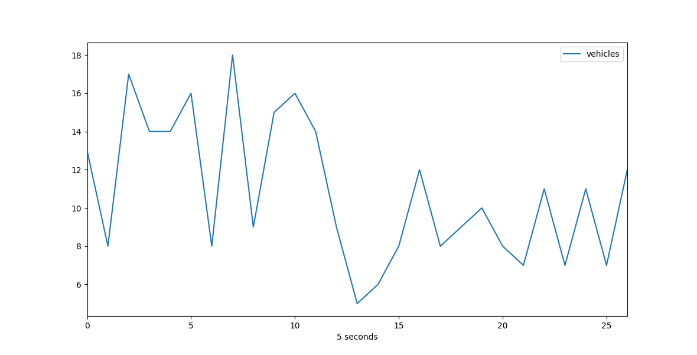

# Traffic counting example based on OpencCV object detection with background subtraction

You can read article for this code [here](https://hackernoon.com/tutorial-making-road-traffic-counting-app-based-on-computer-vision-and-opencv-166937911660)

[@haider8645]( https://github.com/haider8645 ) added multiline counting support, it in separate brunch.

**Speed:** 10.7 FPS (with visualization) 44.5 FPS (without visualization)

### Video visualization demo
[](https://youtu.be/_o5iLbRHKao)

### Report example


## Data
Go to http://keepvid.com/ and download video in 720p quality with url https://youtu.be/wqctLW0Hb_0

After running the script with defualt settings you will get **./out** dir with debug frames images and **report.csv** file with format "time, vehicles".

## How to run script
```
pip install -r ../requirements.txt
```

Edit **traffic.py** if needed:
```
IMAGE_DIR = "./out"
VIDEO_SOURCE = "input.mp4"
SHAPE = (720, 1280)  # HxW
EXIT_PTS = np.array([
    [[732, 720], [732, 590], [1280, 500], [1280, 720]],
    [[0, 400], [645, 400], [645, 0], [0, 0]]
])

...

pipeline = PipelineRunner(pipeline=[
        ContourDetection(bg_subtractor=bg_subtractor,
                         save_image=True, image_dir=IMAGE_DIR),
        # we use y_weight == 2.0 because traffic are moving vertically on video
        # use x_weight == 2.0 for horizontal.
        VehicleCounter(exit_masks=[exit_mask], y_weight=2.0),
        Visualizer(image_dir=IMAGE_DIR),
        CsvWriter(path='./', name='report.csv')
    ], log_level=logging.DEBUG)
```
Run script:
```
python traffic.py
```

## How to create video from processed images
```
chmod a+x make_video.sh
./make_video.sh
```

## How to create report plot
```
python plot.py [path to the csv report] [number of seconds to group by] 
```

## Subscribe to our Machine Learning blog
[Blog](https://medium.com/machine-learning-world)
[Telegram channel](https://t.me/ml_world)

## Support 

If you like what im doing, you can send me some money for pepsi(i dont drink alcohol).
https://www.paypal.me/creotiv

